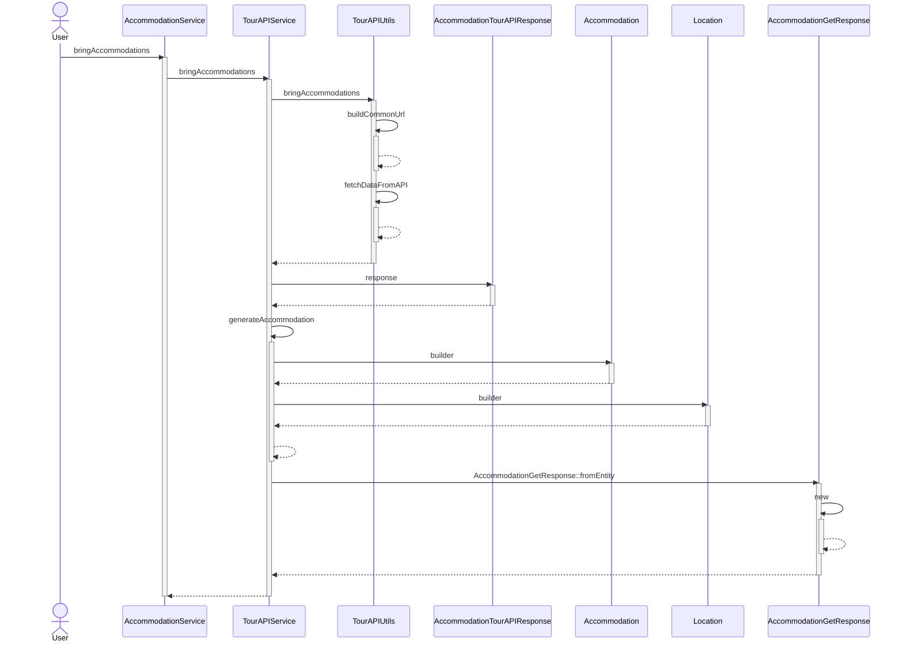
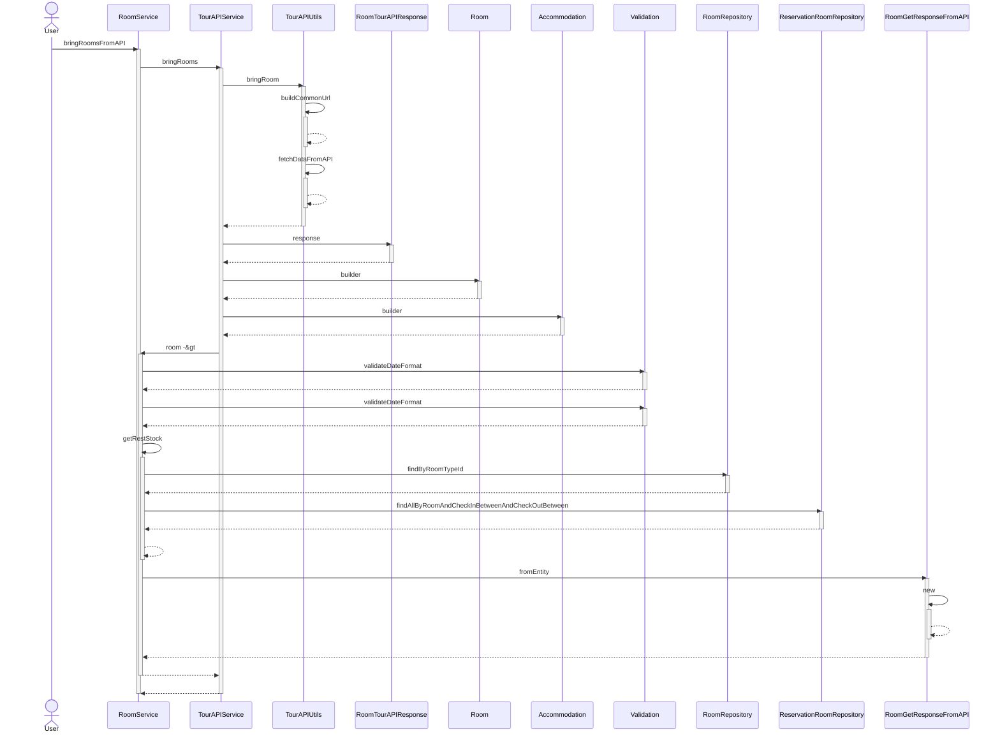
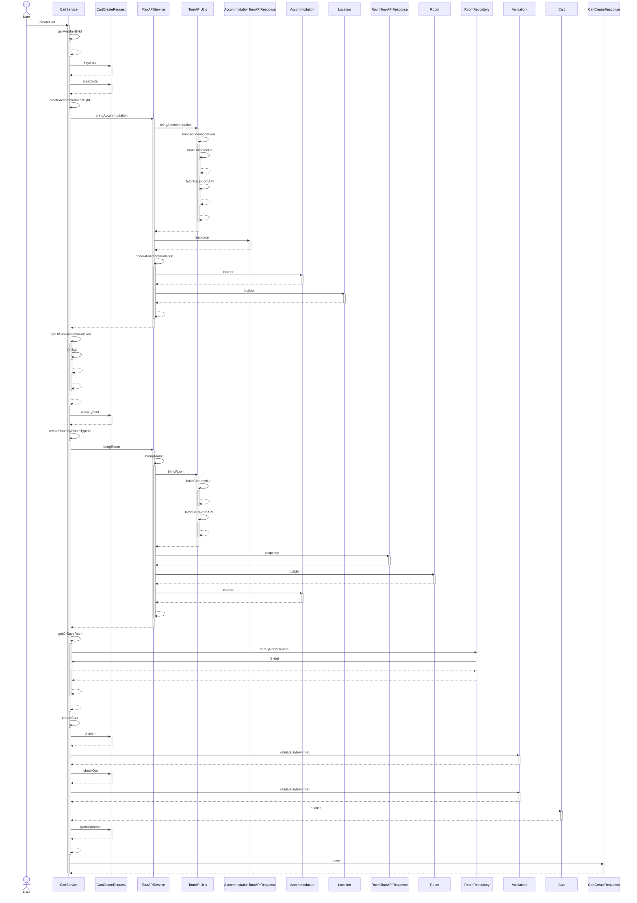
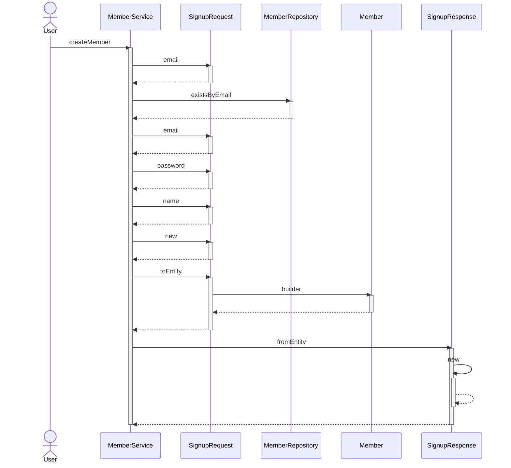

```mermaid
sequenceDiagram
actor User
User ->> ReservationService : createReservation
activate ReservationService
ReservationService ->> ReservationCreateRequest : reservationRooms
activate ReservationCreateRequest
ReservationCreateRequest -->> ReservationService : #32; 
deactivate ReservationCreateRequest
ReservationService ->> ReservationService : reservationRoomDtosToEntityList
activate ReservationService
ReservationService ->> ReservationService : reservationRoomDtoToEntity
activate ReservationService
ReservationService ->> ReservationRoomCreateRequest : areaCode
activate ReservationRoomCreateRequest
ReservationRoomCreateRequest -->> ReservationService : #32; 
deactivate ReservationRoomCreateRequest
ReservationService ->> ReservationRoomCreateRequest : areaCode
activate ReservationRoomCreateRequest
ReservationRoomCreateRequest -->> ReservationService : #32; 
deactivate ReservationRoomCreateRequest
ReservationService ->> ReservationRoomCreateRequest : accommodationName
activate ReservationRoomCreateRequest
ReservationRoomCreateRequest -->> ReservationService : #32; 
deactivate ReservationRoomCreateRequest
ReservationService ->> TourAPIService : bringAccommodation
activate TourAPIService
TourAPIService ->> TourAPIUtils : bringAccommodation
activate TourAPIUtils
TourAPIUtils ->> TourAPIUtils : bringAccommodations
activate TourAPIUtils
TourAPIUtils ->> TourAPIUtils : buildCommonUrl
activate TourAPIUtils
TourAPIUtils -->> TourAPIUtils : #32; 
deactivate TourAPIUtils
TourAPIUtils ->> TourAPIUtils : fetchDataFromAPI
activate TourAPIUtils
TourAPIUtils -->> TourAPIUtils : #32; 
deactivate TourAPIUtils
TourAPIUtils -->> TourAPIUtils : #32; 
deactivate TourAPIUtils
TourAPIUtils -->> TourAPIService : #32; 
deactivate TourAPIUtils
TourAPIService ->> AccommodationTourAPIResponse : response
activate AccommodationTourAPIResponse
AccommodationTourAPIResponse -->> TourAPIService : #32; 
deactivate AccommodationTourAPIResponse
TourAPIService ->> TourAPIService : generateAccommodation
activate TourAPIService
TourAPIService ->> Accommodation : builder
activate Accommodation
Accommodation -->> TourAPIService : #32; 
deactivate Accommodation
TourAPIService ->> Location : builder
activate Location
Location -->> TourAPIService : #32; 
deactivate Location
TourAPIService -->> TourAPIService : #32; 
deactivate TourAPIService
TourAPIService -->> ReservationService : #32; 
deactivate TourAPIService
ReservationService ->> ReservationRoomCreateRequest : accommodationId
activate ReservationRoomCreateRequest
ReservationRoomCreateRequest -->> ReservationService : #32; 
deactivate ReservationRoomCreateRequest
ReservationService ->> ReservationRoomCreateRequest : roomTypeId
activate ReservationRoomCreateRequest
ReservationRoomCreateRequest -->> ReservationService : #32; 
deactivate ReservationRoomCreateRequest
ReservationService ->> TourAPIService : bringRoom
activate TourAPIService
TourAPIService ->> TourAPIService : bringRooms
activate TourAPIService
TourAPIService ->> TourAPIUtils : bringRoom
activate TourAPIUtils
TourAPIUtils ->> TourAPIUtils : buildCommonUrl
activate TourAPIUtils
TourAPIUtils -->> TourAPIUtils : #32; 
deactivate TourAPIUtils
TourAPIUtils ->> TourAPIUtils : fetchDataFromAPI
activate TourAPIUtils
TourAPIUtils -->> TourAPIUtils : #32; 
deactivate TourAPIUtils
TourAPIUtils -->> TourAPIService : #32; 
deactivate TourAPIUtils
TourAPIService ->> RoomTourAPIResponse : response
activate RoomTourAPIResponse
RoomTourAPIResponse -->> TourAPIService : #32; 
deactivate RoomTourAPIResponse
TourAPIService ->> Room : builder
activate Room
Room -->> TourAPIService : #32; 
deactivate Room
TourAPIService ->> Accommodation : builder
activate Accommodation
Accommodation -->> TourAPIService : #32; 
deactivate Accommodation
TourAPIService -->> TourAPIService : #32; 
deactivate TourAPIService
TourAPIService -->> ReservationService : #32; 
deactivate TourAPIService
ReservationService ->> ReservationService : getOrSaveAccommodation
activate ReservationService
ReservationService ->> ReservationService : () -&gt;
activate ReservationService
ReservationService -->> ReservationService : #32; 
deactivate ReservationService
ReservationService -->> ReservationService : #32; 
deactivate ReservationService
ReservationService ->> ReservationService : getOrSaveRoom
activate ReservationService
ReservationService ->> RoomRepository : findByRoomTypeId
activate RoomRepository
RoomRepository ->> ReservationService : () -&gt;
activate ReservationService
ReservationService -->> RoomRepository : #32; 
deactivate ReservationService
RoomRepository -->> ReservationService : #32; 
deactivate RoomRepository
ReservationService -->> ReservationService : #32; 
deactivate ReservationService
ReservationService ->> ReservationRoomCreateRequest : checkIn
activate ReservationRoomCreateRequest
ReservationRoomCreateRequest -->> ReservationService : #32; 
deactivate ReservationRoomCreateRequest
ReservationService ->> Validation : validateDateFormat
activate Validation
Validation -->> ReservationService : #32; 
deactivate Validation
ReservationService ->> ReservationRoomCreateRequest : checkOut
activate ReservationRoomCreateRequest
ReservationRoomCreateRequest -->> ReservationService : #32; 
deactivate ReservationRoomCreateRequest
ReservationService ->> Validation : validateDateFormat
activate Validation
Validation -->> ReservationService : #32; 
deactivate Validation
ReservationService ->> ReservationRoomCreateRequest : guestNumber
activate ReservationRoomCreateRequest
ReservationRoomCreateRequest -->> ReservationService : #32; 
deactivate ReservationRoomCreateRequest
ReservationService ->> ReservationRoom : createReservationRoom
activate ReservationRoom
ReservationRoom ->> ReservationRoom : builder
activate ReservationRoom
ReservationRoom -->> ReservationRoom : #32; 
deactivate ReservationRoom
ReservationRoom -->> ReservationService : #32; 
deactivate ReservationRoom
ReservationService -->> ReservationService : #32; 
deactivate ReservationService
ReservationService ->> ReservationService : this::isEnableReservation
activate ReservationService
ReservationService ->> ReservationService : getRestStock
activate ReservationService
ReservationService ->> ReservationRoomRepository : findAllByRoomAndCheckInBetweenAndCheckOutBetween
activate ReservationRoomRepository
ReservationRoomRepository -->> ReservationService : #32; 
deactivate ReservationRoomRepository
ReservationService -->> ReservationService : #32; 
deactivate ReservationService
ReservationService -->> ReservationService : #32; 
deactivate ReservationService
ReservationService -->> ReservationService : #32; 
deactivate ReservationService
ReservationService ->> ReservationService : getMemberByEmail
activate ReservationService
ReservationService ->> MemberRepository : findByEmail
activate MemberRepository
MemberRepository -->> ReservationService : #32; 
deactivate MemberRepository
ReservationService -->> ReservationService : #32; 
deactivate ReservationService
ReservationService ->> ReservationCreateRequest : paymentType
activate ReservationCreateRequest
ReservationCreateRequest -->> ReservationService : #32; 
deactivate ReservationCreateRequest
ReservationService ->> Reservation : createReservation
activate Reservation
Reservation ->> Reservation : builder
activate Reservation
Reservation ->> Reservation : reservation::addReservationRoom
activate Reservation
Reservation -->> Reservation : #32; 
deactivate Reservation
Reservation -->> Reservation : #32; 
deactivate Reservation
Reservation -->> ReservationService : #32; 
deactivate Reservation
ReservationService ->> ReservationCreateResponse : fromEntity
activate ReservationCreateResponse
ReservationCreateResponse ->> ReservationCreateResponse : builder
activate ReservationCreateResponse
ReservationCreateResponse -->> ReservationCreateResponse : #32; 
deactivate ReservationCreateResponse
ReservationCreateResponse -->> ReservationService : #32; 
deactivate ReservationCreateResponse
deactivate ReservationService

```

## 개요

■ 프로젝트명

- YA 어때

■ 기간

- 2023.11.17 ~ 2023.12.01

■ 목적

- 협업 및 팀워크 증진을 통하여 동일한 목표 달성 및 성취

### Backend

|  |  |  |  |
| :----------------------------------------------------------- | :----------------------------------------------------------- | :----------------------------------------------------------- | :----------------------------------------------------------- |
| [현](https://github.com/yuhyun1)                             | [성수](https://github.com/tjdtn0219)                         | [재욱](https://github.com/laigasus)                          | [민정](https://github.com/ypd06021)                          |
| - 숙소 및 객실 조회  - 예외처리 및 validation Biz  - 테스트 코드(Junit,Mockito)  - Flyway | - 예약  - 예외처리 및 validation Biz  - 테스트 코드(Junit,Mockito)  - 도메인 설계| 회원  - TourAPI 가공   - Security  - 예외처리 밒 validation 공통  - 인프라 및 배포  - 테스트 코드(Junit,Mockito) | 장바구니  - 예외처리 및 validation Biz  - 테스트 코드(Junit,Mockito)  - CI  - Flyway |

---

## 진행 방식

Agile - Scrum
XP - PairProgramming(Intellij codewithme)

---

## 구현 환경

- Java 17
- Spring Boot 3.x
- Spring security 6.x
- Docker
- intellij
- gradle
- github action(CI) 
- PaaS(railway)
  - 자동으로 Dockerfile을 수행하도록 설정
  - 개발환경에서만 docker-compose 사용

- Flyway
- JPA
- querydsl
- jwt(refresh +access, Redis) 
  - rfc 문서 참고하여 구현

---

## 브랜치 전략

Git-flow 사용

---

## 사용

1. Docker 로 DB를 활성화 할 수 있습니다 `docker-compose up`
2. SpringBoot 를 실행합니다
3. test/Http 내 작성해둔 http 테스트 파일이 있습니다
4. 테스트 코드도 작성하여 확인하실 수 있습니다

---

## 기능

### 회원

회원에 대한 가입, 로그인, 조회, 수정, 삭제를 할 수 있다.

- 회원 가입
- 로그인
- 회원 정보 조회
- 회원 정보 수정
- 회원 삭제

---

### TourAPI 

공공 데이터로부터 숙박 및 객실 정보를 받아온다.

- 숙소 다건 조회
- 숙소 단건 조회
- 객실 다건 조회
- 객실 단건 조회

---

### 숙소 검색

사용자가 숙소 및 객실 정보를 조회할 수 있다.

- 키워드 검색
- 키워드 + 지역 코드 검색
- 지역 코드 검색
- 검색 조건 없이 전체 조회 (페이징 구현)
- 숙소 상세 조회
- 숙소 ID에 해당하는 객실 전체 조회

---

### 장바구니

사용자가 원하는 객실을 장바구니에 추가, 조회, 삭제할 수 있다.

- 장바구니 전체 조회
- 장바구니 추가
- 장바구니 삭제

---

### 예약

사용자는 원하는 객실을 예약할 수 있다.

- 날짜 별 잔여 재고 동기화
- 객실 예약
- 장바구니 상품 묶음 예약
- 예약 내역 조회
- 예약 취소

---

## API

[Notion 참고](https://decorous-jupiter-fb4.notion.site/api-ae76fa9fd32e40c6b5408f1bcfecaad3)

---

## ERD

### DB Diagram

---

## 흐름도

### 숙소

### 객실

### 장바구니

### 예약

### 회원

